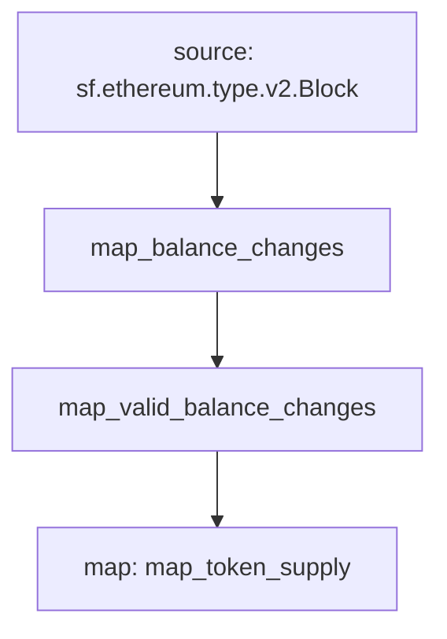

# ERC-20 Token Supply Substreams

> Extends [ERC-20 Balance Changes](https://github.com/streamingfast/substreams-erc20-balance-changes) with Token Supply

## Quickstart

```
$ gh repo clone pinax-network/substreams-erc20-total-supply
$ cd substreams-erc20-total-supply
$ make
$ make gui
```

## Releases

- https://github.com/pinax-network/substreams-erc20-total-supply/releases

## References
- [Ethereum Docs: ERC-20 Token Standard](https://ethereum.org/en/developers/docs/standards/tokens/erc-20/)
- [EIPS: ERC-20 Token Standard ](https://eips.ethereum.org/EIPS/eip-20)
- [OpenZeppelin implementation](https://github.com/OpenZeppelin/openzeppelin-contracts/blob/9b3710465583284b8c4c5d2245749246bb2e0094/contracts/token/ERC20/ERC20.sol)
- [ConsenSys implementation](https://github.com/ConsenSys/Tokens/blob/fdf687c69d998266a95f15216b1955a4965a0a6d/contracts/eip20/EIP20.sol)

### Mermaid graph



### Modules

```yaml
Package name: erc20_supply
Version: v0.1.0
Doc: ERC-20 Token Supply
Modules:
----
Name: map_token_supply
Initial block: 1397553
Kind: map
Output Type: proto:erc20.supply.types.v1.TotalSupplies
Hash: 87ad90dfb4649470424b6259b141339db719eba6
Doc: Extracts ERC20 token total supply
```