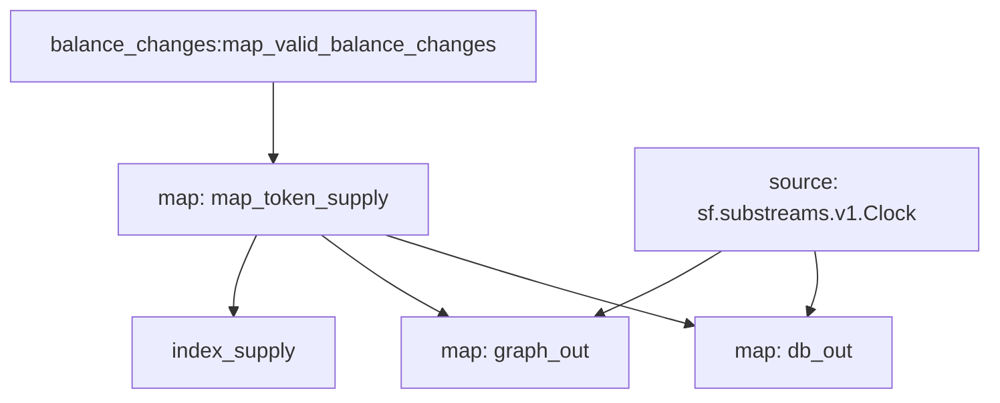

# `ERC-20` Token Supply [Substreams](https://substreams.streamingfast.io)

[](https://github.com/pinax-network/substreams-erc20-supply/actions/workflows/test.yml)


> Extends [ERC-20 Balance Changes](https://github.com/streamingfast/substreams-erc20-balance-changes) with token supply.

### First block containing ERC20 Transfers

| Chain   | Block number |
| ------- | ------------ |
| ETH     | 913 198      |
| Polygon | 2764         |
| BSC     | 64 253       |

## Quickstart

```
$ gh repo clone pinax-network/substreams-erc20-supply
$ cd substreams-erc20-supply
$ make
$ make gui
```

## Releases `.spkg`

- https://github.com/pinax-network/substreams-erc20-supply/releases

## References

- [Ethereum Docs: ERC-20 Token Standard](https://ethereum.org/en/developers/docs/standards/tokens/erc-20/)
- [EIPS: ERC-20 Token Standard ](https://eips.ethereum.org/EIPS/eip-20)
- [OpenZeppelin implementation](https://github.com/OpenZeppelin/openzeppelin-contracts/blob/9b3710465583284b8c4c5d2245749246bb2e0094/contracts/token/ERC20/ERC20.sol)
- [ConsenSys implementation](https://github.com/ConsenSys/Tokens/blob/fdf687c69d998266a95f15216b1955a4965a0a6d/contracts/eip20/EIP20.sol)

## Map Outputs

### `map_token_supply`

```json
{
  "items": [
    {
      "address": "dac17f958d2ee523a2206206994597c13d831ec7",
      "supply": "39025187376288180"
    },
    {
      "address": "c944e90c64b2c07662a292be6244bdf05cda44a7",
      "supply": "10759041473295613153705888512"
    },
    ...
  ]
}
```

### `graph_out`

```json
{
  "entityChanges": [
    {
      "entity": "TotalSupply",
      "id": "c944e90c64b2c07662a292be6244bdf05cda44a7",
      "ordinal": "0",
      "operation": "OPERATION_CREATE",
      "fields": [
        {
          "name": "address",
          "newValue": { "string": "c944e90c64b2c07662a292be6244bdf05cda44a7" }
        },
        {
          "name": "block",
          "newValue": { "bigint": "18242188" }
        },
        {
          "name": "supply",
          "newValue": { "bigint": "10759041473295613153705888512" }
        },
        {
          "name": "timestamp",
          "newValue": { "bigint": "1696000391" }
        }
      ]
    },
    ...
  ]
}
```

### Mermaid graph



### Modules

```yaml
Package name: erc20_supply
Version: v0.1.0
Doc: ERC-20 Token Supply
Modules:
----
Name: map_token_supply
Initial block: 0
Kind: map
Input: map: balance_changes:map_valid_balance_changes
Output Type: proto:erc20.supply.types.v1.TotalSupplies
Hash: 1a52db6b9bdebc701a25f8a08a1327ac6ce8c766
Doc:  Extracts ERC20 token total supply

Name: index_supply
Initial block: 0
Kind: index
Input: map: map_token_supply
Output Type: proto:sf.substreams.index.v1.Keys
Hash: 8f3990934d95fce8b9fadfdef645f9e83c266e45

Name: graph_out
Initial block: 0
Kind: map
Input: source: sf.substreams.v1.Clock
Input: map: map_token_supply
Output Type: proto:sf.substreams.sink.entity.v1.EntityChanges
Hash: b8127494230b953cf72fa45ee4b86f4a2b2c1bdf

Name: db_out
Initial block: 0
Kind: map
Input: source: sf.substreams.v1.Clock
Input: map: map_token_supply
Block Filter: (using *index_supply*): `&{suuply}`
Output Type: proto:sf.substreams.sink.database.v1.DatabaseChanges
Hash: 6c74a94ce5e0b0ef71e0f8344587d3eb0e5cb99e
```
