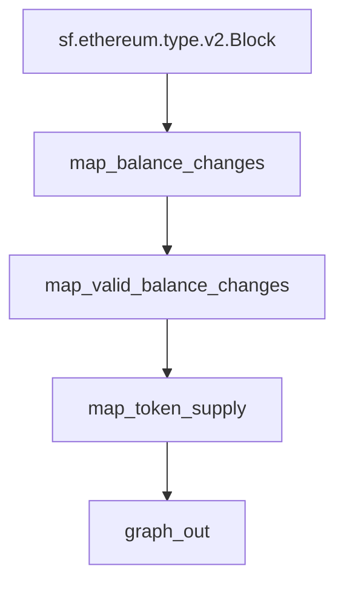

# `ERC-20` Token Supply Substreams

> Extends [ERC-20 Balance Changes](https://github.com/streamingfast/substreams-erc20-balance-changes) with total Token Supply.

## Quickstart

```
$ gh repo clone pinax-network/substreams-erc20-supply
$ cd substreams-erc20-supply
$ make
$ make gui
```

## Releases `.spkg`

- https://github.com/pinax-network/substreams-erc20-supply/releases

## References
- [Ethereum Docs: ERC-20 Token Standard](https://ethereum.org/en/developers/docs/standards/tokens/erc-20/)
- [EIPS: ERC-20 Token Standard ](https://eips.ethereum.org/EIPS/eip-20)
- [OpenZeppelin implementation](https://github.com/OpenZeppelin/openzeppelin-contracts/blob/9b3710465583284b8c4c5d2245749246bb2e0094/contracts/token/ERC20/ERC20.sol)
- [ConsenSys implementation](https://github.com/ConsenSys/Tokens/blob/fdf687c69d998266a95f15216b1955a4965a0a6d/contracts/eip20/EIP20.sol)

## Map Outputs

### `map_token_supply`

```json
{
  "totalSupplies": [
    {
      "address": "dac17f958d2ee523a2206206994597c13d831ec7",
      "supply": "39025187376288180"
    },
    {
      "address": "c944e90c64b2c07662a292be6244bdf05cda44a7",
      "supply": "10759041473295613153705888512"
    },
    ...
  ]
}
```

### Mermaid graph



### Modules

```yaml
Package name: erc20_supply
Version: v0.1.0
Doc: ERC-20 Token Supply
Modules:
----
Name: map_token_supply
Initial block: 0
Kind: map
Output Type: proto:erc20.supply.types.v1.TotalSupplies
Hash: 2823c53215a935dd31d6acdfc69d9ea05f47e3c1
Doc: Extracts ERC20 token total supply

Name: graph_out
Initial block: 0
Kind: map
Output Type: proto:sf.substreams.sink.entity.v1.EntityChanges
Hash: f962b399a17485487567db433ea8292f1444aeb7
```
